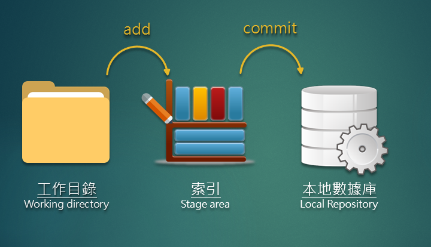

# 1.3 Git 基礎操作\(上\)

1. 教學大綱

2. git init - 安裝數據庫

3. 工作目錄、加入索引、提交版本流程介紹

4. 基礎指令教學流程

commit process:  
`git add .   
git commit -m 'release msg'`

status check :  
`git status`

check log:  
`git log`

5. git push - 推送數據庫到 Github  
`git add .   
git commit -m 'release msg'   
git remote add origin https://github.com/avantsao/test.git   
git push -u origin master`

Push to remote repository

