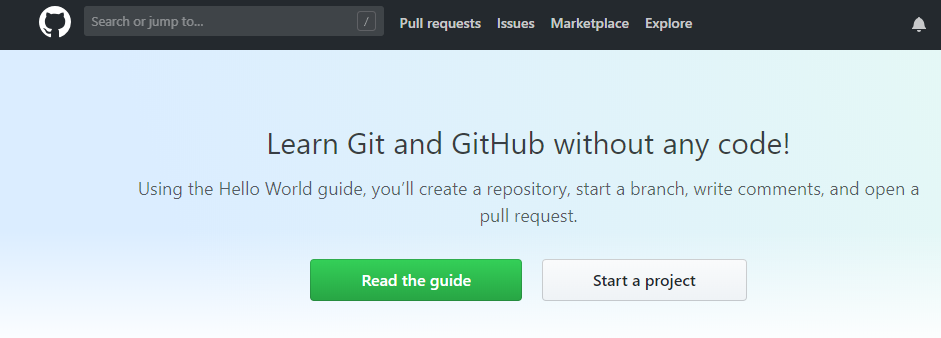

# Ch1 : Git Version control

### **Github - \(6/29/2018\)** {#github-6-29-2018}

**1. Github 註冊流程**

**2. Fork other Github resource**

**3. 從 Github 找出實用資源流程**

## ​ {#undefined}

### **環境安裝 - \(7/3/2018\)** {#jing-an-7-3-2018}

**1. Git 環境安裝**

* ​[**Git 官網**](https://git-scm.com/)​

**2. Windows - 命令提示字元教學**

* 基本 command 操作指令
  * cd       ······· \(切換工作路徑\)
  * mkdir ······· \(新增資料夾\)
  * ls        ······· \(列出清單\)
  * touch ······· \(產生新檔\)

**3. Git 環境設定**

command:  
`git config --global user.email "你的 email"   
git config --global user.name "你的 name"`

ex :  
`git config --global user.email "avantsao@gmail.com"   
git config --global user.name "avantsao"`

check:  
`git config --list | grep -i user`

​

#### _Git Official Site_ {#git-official-site}

​

​

### Git 基礎操作\(上\) {#git-ji-cao-zuo-shang}

1. 教學大綱圖

2. git init - 安裝數據庫

3. 工作目錄、加入索引、提交版本流程介紹

4. 基礎指令教學流程

commit process:  
`git add .   
git commit -m 'release msg'`

status check :  
`git status`

check log:  
`git log`

5. git push - 推送數據庫到 Github  
`git add .   
git commit -m 'release msg'   
git remote add origin https://github.com/avantsao/test.git   
git push -u origin master`

​

## ​ {#undefined-1}

### Git 基礎操作\(下\) {#git-ji-cao-zuo-xia}

1. 工作狀態還原技巧分享
2. gitignore - 忽略檔案
3. ​[gitignore 大全](https://github.com/github/gitignore)​
4. 指令參考

​

## ​ {#undefined-2}

### Git 分支 \(branch\) {#git-fen-zhi-branch}

1. 分支簡介
2. HEAD - 瞭解目前所在位置
3. git branch - 分支創立
4. git merge - fast-forward
5. git merge - 自動合併
6. git merge - 解決衝突
7. git tag - 標籤
8. git stash - 暫存檔案

​

## ​ {#undefined-3}

### Git、Github 團隊協作篇 {#gitgithub-zuo-pian}

1. git remote - 遠端數據庫
2. git pull - 下載遠端數據庫
3. git pull - 衝突
4. Github Pages - 存放網頁空間流程
5. 小型團隊分支協作
6. git pull = git fetch + git merge

